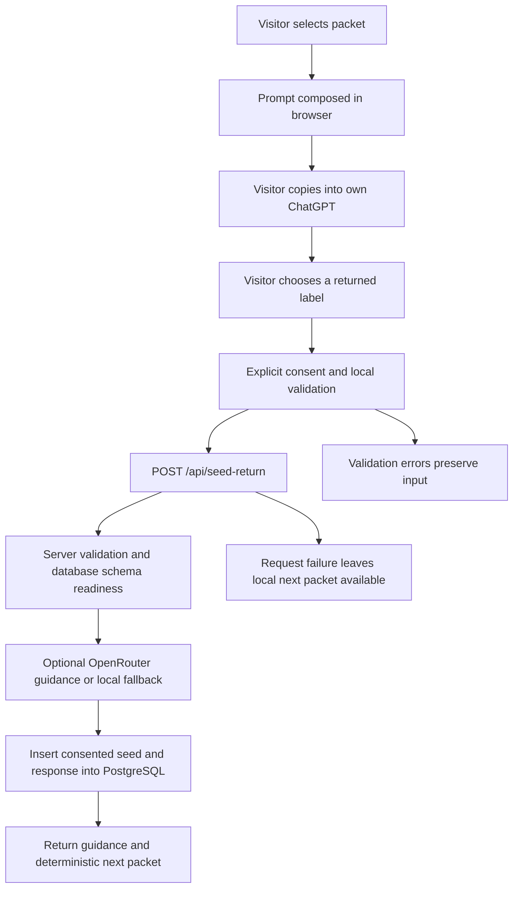

# Bloomin project handoff

Prepared: **2026-10-02 (UTC)**. Intended reader: a fresh LLM workstream taking over the project with enough context to act carefully and efficiently.

Publication follow-up: on **2026-10-05**, the user requested that this document be committed and merged into `main`. The implementation, environment and verification observations below remain dated to the original preparation unless explicitly stated otherwise. Use Git history for the document's current publication state.

Navigation: [Snapshot](#1-read-this-first) · [Evidence and chats](#2-evidence-transcript-provenance-and-limits) · [Product doctrine](#3-product-identity-and-standards-of-care) · [Files and assets](#4-repository-and-asset-map) · [Systems](#5-systems-and-access-map) · [Setup](#6-efficient-setup-and-runbook) · [Frontend](#7-frontend-architecture-and-visitor-journey) · [Protocol](#8-seedkind-protocol-contract) · [API and database](#9-backend-api-and-data-contract) · [AI and privacy](#10-openrouter-configuration-and-privacy-boundaries) · [Deployment](#11-deployment-and-hostname-maintenance) · [Verification](#12-verification-evidence-and-test-limits) · [Gaps](#13-known-gaps-differences-and-recommended-follow-up) · [Change map and history](#14-change-map-and-historical-decisions) · [Successor instructions](#15-instructions-for-the-successor-workstream) · [Delivery state](#16-handoff-delivery-state).

## 1. Read this first

Bloomin is a small, functioning, hostname-aware React/Vite website with four public identities sharing one constitution, visual language, and Eden experience. **Eden** is the visitor experience; **SeedKind** is its reflection protocol. Visitors select a seed packet, copy its prompt into their own ChatGPT, and optionally return a structured, consented label. The Node backend stores returned labels in PostgreSQL and optionally asks OpenRouter for short guidance. The visitor's original ChatGPT conversation is not integrated with or automatically available to Bloomin.

The central design commitment is sovereignty before capture: human dignity, belonging, gentle practice, giving without depletion, and technology as a quiet supporting root system. Preserve that commitment when changing copy, interaction, data collection, or AI behavior.

The immediate user request was to create this comprehensive handoff for a new thread. **No next feature, redesign, deployment, database migration, or production change was requested in this handoff task.** Suggestions below are recommendations or observed gaps, not an approved backlog.

### October 2 inspection snapshot

| Item | Verified state at handoff |
| --- | --- |
| Canonical repository | [bob-stewart/bloomin](https://github.com/bob-stewart/bloomin) |
| Default remote branch | `main`, verified with `git ls-remote --symref origin HEAD refs/heads/main` |
| Inspected commit | [`bda1d6e3a1d81360f3d822ffca5d440f07d2414e`](https://github.com/bob-stewart/bloomin/commit/bda1d6e3a1d81360f3d822ffca5d440f07d2414e), also remote `main` at inspection |
| Commit meaning | Merge PR #6, “Make Eden choose seed packets first,” dated 2026-07-06 |
| Current checkout | `/workspace/bloomin`; local branch `work` |
| Initial working tree | Clean; no project `AGENTS.md` found in the repository root or inspected ancestor paths |
| Current task deliverable | This file, `/workspace/bloomin/bloomin-project-handoff.md`; application source and lockfile left unchanged |
| Prepared cloud tools | `/workspace/.bloomin-env` exists outside Git; use its Node activation and Playwright override |
| Supported runtime | Node `22.x`; prepared and verified Node `22.23.3`, npm `10.9.9` |
| Local validation | 17 unit tests, production build, 56 browser smoke tests, actual PostgreSQL insert/readback/cleanup passed in this handoff task |
| Live AI | OpenRouter not configured in the local helper; local fallback verified; live provider calls unverified |
| Production | Railway and Cloudflare are the documented deployment/DNS systems; no production dashboard, public domain, or production database checks performed here |
| Open work on GitHub | Connected GitHub search `repo:bob-stewart/bloomin is:open` returned no open issues/PRs at inspection; recheck before starting work |

### Fast onboarding order

1. Read sections 1–5 of this document for state, provenance, product intent, and systems.
2. Read [README](/workspace/bloomin/README.md), the [approved SeedKind design](/workspace/bloomin/docs/superpowers/specs/2026-07-05-seedkind-eden-protocol-design.md), and [TEST_PLAN](/workspace/bloomin/TEST_PLAN.md).
3. Read [cloud startup instructions](/workspace/.bloomin-env/START.md), if present in the new workspace. These are environment files, not repository files.
4. Run the setup/verification commands in section 6. Check branch, commit, dirty files, and occupied ports first.
5. Read source relevant to the next request using the file map and change map below. Do not replay the historical implementation plan as unfinished work.
6. Review known gaps in section 13 before claiming production readiness or changing the return contract.

## 2. Evidence, transcript provenance, and limits

This document combines the visible user request, directly inspected repository files and Git history, accessible related setup chats, live local checks, and limited GitHub metadata. It is not a verbatim export of an original design conversation.

### Recovered chat sources

Both setup chats below are titled **“Set up bloomin”**; use the IDs to distinguish them. Both were read through the Codex app's `read_thread` capability with `hostId: "durable"`.

| Source | Identifier | Relevant findings |
| --- | --- | --- |
| Current handoff chat | `01a0fc8d-ad7e-711c-a54d-6a25444c80f9` | User requests a maximally comprehensive handoff for another LLM workstream. |
| Later/full-stack setup chat | `01a0fc7c-13d7-76a6-8dc4-df4b358db0eb` | Prepared `/workspace/.bloomin-env`, Node 22, system-Chromium override, local PostgreSQL, real persistence probe, saved `install_script` and `start_skill`. Reported all tests green and requested review/publication of the environment draft. Its prepared files are present in this handoff workspace. |
| Earlier/frontend-oriented setup chat | `01a0fc76-bd56-71e3-8a70-c692bbabf0c2` | Prepared an alternate `/workspace/.bloomin-tools` layout, verified frontend/unit/build/browser/API validation, but did not configure PostgreSQL. Those helper paths are not present in this handoff workspace. Do not confuse its unconfigured-database report with the later full-stack setup. |

To retrieve a source again when supported: discover `codex_app__read_thread`, pass the exact thread ID and host, and use `turnLimit: 10` or lower. Use `includeOutputs: true` only when tool evidence or saved setup scripts are needed. Process large tool results selectively rather than dumping entire histories. The two recovered setup chats each returned a complete single-turn history, with no older page.

The July 5 design conversation itself was **not directly retrieved**. The tracked design document explicitly says it was approved from that conversation. The tracked plan records implementation authorization as “make it sew.” Treat those as documentary evidence about that historical scope, not blanket permission for unrelated future work.

The Codex app also lists a local project named `bloomin`:

- Project ID: `local-5a98ee1ddd65f697e2f667d52e6d8e58`.
- Local Mac checkout: `/Users/bobstewart/dev/bloomin`.
- Host: `local`.
- That checkout was not inspected or synchronized during this handoff. Do not assume it has the same uncommitted files or branch as the cloud checkout.

### How to resolve conflicting evidence

- Current source and fresh execution establish implemented behavior.
- The approved design establishes product intent and care requirements.
- README/test plan describe the workflow but contain some historical wording.
- The implementation plan is an historical build recipe with unchecked boxes; its “frontend-only for this pass” statement is superseded by the implemented backend.
- A passing mocked UI test does not establish database or provider connectivity.
- A previous chat's report is historical evidence until reproduced in the current environment.
- The repository snapshot is July code inspected in October. Date differences are real; this document does not imply intervening feature development.

No separate attached transcript file, Figma file, external asset library, full constitutional document, issue tracker project, production service ID, or production secret was supplied or discovered in the inspected project sources. Their absence here is an access/discovery limit, not proof they do not exist.

## 3. Product identity and standards of care

### Four doors into one ecosystem

The four sites are selected in the browser from `window.location.hostname`, with a leading `www.` removed. They share the same bundle and backend. They are not four separate repositories or deployments in the source architecture.

| Public address | Identity and role | Hero line | Primary CTA and destination |
| --- | --- | --- | --- |
| [bloom.giving](https://bloom.giving) | Bloom Giving; philosophy, public invitation, Honor Good | “Give more than you take.” | “Honor Good” → `#role` |
| [bloomin.institute](https://bloomin.institute) | The Bloomin' Institute; research, protocols, AI-IRB, AI-SDLC, DOE | “Discipline in service of flourishing.” | “Explore the Protocol” → `#role` |
| [bloomin.foundation](https://bloomin.foundation) | The Bloomin' Foundation; stewardship, grants, scholarships, Honor Good, public benefit | “Leave more than you found.” | “Steward the Garden” → `#role` |
| [bloom.gdn](https://bloom.gdn) | Bloom Garden; garden/apothecary, visual ecosystem, living symbolic home | “Choose a seed packet. Keep the first conversation yours.” | “Choose a Seed Packet” → `#eden` |
| [Railway hostname](https://bloomin-production.up.railway.app) and unknown/local hostnames | Keep Bloomin'; launch preview/shared ecosystem | “Technology as root system. Bloom as invitation.” | “Begin Bloomin'” → `#role` |

Garden's secondary CTA is “Enter the Garden” → `#role`. Other hosts' secondary CTA is “Plant a Seed” → `#eden`. The desktop navigation includes “Plant a Seed” on every host.

AI-IRB, AI-SDLC, DOE, grants, scholarships, and Honor Good appear as mission/content language. There are no corresponding operational review systems, grant workflows, payment flows, or administration tools in this repository. Do not infer that those systems have already been built, or invent external repository links for them.

### Shared Bloom Constitution

The six implemented principles are:

1. **Intrinsic human dignity:** people are worthy and cannot be reduced to output, data, role, or utility.
2. **Stewardship over extraction:** systems should return more trust, capability, and fertility than they consume.
3. **Belonging as soil:** growth needs safety, agency, and welcome.
4. **Technology as root system:** machinery stays quiet and accountable beneath human flourishing.
5. **Bloom as condition:** create conditions for truth, trust, curiosity, competence, and care.
6. **Bloomin' as practice:** daily tending; honor good, give more, leave more, keep cultivating.

Closing copy: **“Technology roots. People bloom.”** and **“Honor Good. Keep Bloomin'.”** These principles and copy live in `src/main.jsx`; the section is an introduction to the ethos, not evidence of a separate comprehensive legal/constitutional instrument.

The full shared-ethos line is **“Honor Good. Cultivate Belonging. Give More Than You Take. Leave More Than You Found. Keep Bloomin'.”** Preserve the distinction between Bloom as a condition/environment and Bloomin' as the practice of tending it.

### Three distinct sequences: preserve their meanings

| Sequence | Exact order | Purpose |
| --- | --- | --- |
| Bloom Cycle | Truth → Trust → Belonging → Curiosity → Exploration → Competence → Contribution → Merit → Stewardship → Bloom | Shared ecosystem cycle; `src/main.jsx` |
| Hero circulation | Root → Ground → Flow → Shine → Love → Say → See → Know | SVG/visual circulation; `src/main.jsx` |
| SeedKind growth ladder | Soil → Seed → Shoot → Root → Stalk → Leaf → Bud → Petal → Bloom | Reflection stages and return protocol; `src/seedkind.mjs` |

Do not merge, reorder, or casually rename these sequences. The last ladder stage advances to the conceptual next step `Giving / Pollination / Branch`; that phrase is not an accepted returned `stage` value.

### Eden / SeedKind doctrine

- The first conversation belongs to the visitor and runs in their own ChatGPT.
- Bloomin supplies seed packets, structure, and optional tending of returned labels. It does not host or ingest that private conversation automatically.
- Every seed matters before it is useful. A dream set down for survival deserves witness, not shame.
- The aim is gentle rematerialization: one truthful, practicable act within the life that currently protects the visitor.
- Respect scars, survival wisdom, weathered strength, and boundaries without romanticizing harm or claiming storms were necessary or good.
- Giving must not become depletion. Ask both what someone can give and what they gave up to survive.
- Use **Within / Between / Beyond** at every stage: inner life, relationships/conditions, and what this may nourish beyond the self.
- Pollination is relational throughout the process, not solely a final achievement.
- **Self:** private reflection. **Branch:** optional invitation to a trusted relation. **Grove:** envisioned consent-bound community work, not an implemented group feature.
- Preserve the intentional welcome phrase: **“You are well come here, if this would help you grow.”** It is not a typo to normalize into recruitment copy.

### Prompt and experience guardrails

The standard seed prompts require one question at a time, no diagnosis, no rushing, no forced positivity, respect for boundaries, and giving without depletion. They include crisis-support language for imminent harm, abuse, medical crisis, or severe distress, directing the visitor toward local emergency services, crisis resources, trusted people, or qualified professionals.

The design rejects scoring human worth, hidden profiling, compulsory accounts, default sharing, interpreting someone else's returned seed without consent, pressure to invite others, and replacing professional care. These are product requirements, not a claim that the current implementation enforces every requirement technically in every output path. Review the differences in section 13.

The desired tone is **plain, warm, practical, calm, and a little ceremonial**: apothecary craft, living meaning, patient tending, useful beauty. It should feel like a trustworthy ritual, not lead capture, a productivity worksheet, or an AI dashboard.

## 4. Repository and asset map

Paths below are absolute for this cloud workspace. If reading a clone elsewhere, replace `/workspace/bloomin` with its actual root. Environment helpers under `/workspace/.bloomin-env` are not part of the clone.

| Path | Role / when to read or edit |
| --- | --- |
| [README.md](/workspace/bloomin/README.md) | Project overview, site roles, API/env basics, local/verification/Railway commands. |
| [TEST_PLAN.md](/workspace/bloomin/TEST_PLAN.md) | Automated coverage, manual tone/design review, deployment verification and acceptance criteria. |
| [Approved design](/workspace/bloomin/docs/superpowers/specs/2026-07-05-seedkind-eden-protocol-design.md) | Full product doctrine, inquiries, visitor journey, return contract, safety, initial scope. Read before product changes. |
| [Historical implementation plan](/workspace/bloomin/docs/superpowers/plans/2026-07-05-seedkind-eden.md) | Original frontend-only implementation instructions; useful rationale, not current task status. |
| [src/main.jsx](/workspace/bloomin/src/main.jsx) | Host content records/default, constitution, cycle, hero SVG/image, role section, ecosystem links, page composition and mount. |
| [src/SeedKindEden.jsx](/workspace/bloomin/src/SeedKindEden.jsx) | Five packet definitions, default/example label, all Eden form state, clipboard, local validation, API POST, feedback/fallback and invitation UI. |
| [src/seedkind.mjs](/workspace/bloomin/src/seedkind.mjs) | Shared pure protocol constants, normalization, prompt builders, parser, stage advancement and branch invitation. Imported by client and server. |
| [src/styles.css](/workspace/bloomin/src/styles.css) | All design tokens, themes, layouts, component styles, animation, breakpoints and reduced motion. |
| [server.mjs](/workspace/bloomin/server.mjs) | Native Node HTTP server, body limits, routing, PostgreSQL pool/schema/insert, static build serving and shutdown. |
| [server/seedkind-api.mjs](/workspace/bloomin/server/seedkind-api.mjs) | Request validation/normalization, fallback guidance, OpenRouter request/parser, DB record and response construction. |
| [tests/seedkind.test.mjs](/workspace/bloomin/tests/seedkind.test.mjs) | Nine pure protocol tests. |
| [tests/seedkind-server.test.mjs](/workspace/bloomin/tests/seedkind-server.test.mjs) | Eight backend helper tests; provider request mocked. |
| [tests/launch-hosts.spec.js](/workspace/bloomin/tests/launch-hosts.spec.js) | Host acceptance, four domain UI journeys, consented mocked return, image/layout/reduced motion tests. |
| [playwright.config.js](/workspace/bloomin/playwright.config.js) | Chromium projects at four viewports, hostname-to-loopback resolver rules, production-server startup. |
| [vite.config.js](/workspace/bloomin/vite.config.js) | React plugin; explicit dev/preview allowed hostnames; no API proxy. |
| [package.json](/workspace/bloomin/package.json) / [package-lock.json](/workspace/bloomin/package-lock.json) | Runtime requirement, scripts, dependencies and resolved reproducible package versions. |
| [railway.json](/workspace/bloomin/railway.json) | Railpack build, start command, restart policy. |
| [.github/workflows/ci.yml](/workspace/bloomin/.github/workflows/ci.yml) | Node 22 CI install, unit, build, Chromium install, smoke tests. |
| [index.html](/workspace/bloomin/index.html) | English HTML shell, viewport meta, generic `Bloomin' Sites` document title and root mount. |
| [.gitignore](/workspace/bloomin/.gitignore) | Excludes dependencies/build/test outputs and secrets; allows `.env.example` but none is tracked. |
| `/workspace/bloomin/dist/` | Generated production output; rebuild after client changes; ignored by Git. |
| `/workspace/bloomin/node_modules/` | Installed dependencies; ignored. |
| `/workspace/bloomin/test-results/` | Playwright `.last-run.json`, traces/error context when failures occur; ignored, replaceable by later runs. |
| `/workspace/bloomin/playwright-report/` | Potential generated report directory; ignored, not guaranteed to exist. |

### Authored visual assets

| Asset | Bytes / intrinsic dimensions | Usage |
| --- | --- | --- |
| [bloomin-living-bloom-apothecary.avif](/workspace/bloomin/src/assets/bloomin-living-bloom-apothecary.avif) | 59,471 bytes; 1400 × 788 | Hero on every host; imported by `src/main.jsx`. Pink flower, seed packets, herbs, amber bottles; async decode, high fetch priority. |
| [bloomin-apothecary-seed-packets.avif](/workspace/bloomin/src/assets/bloomin-apothecary-seed-packets.avif) | 61,591 bytes; 1200 × 676 | Eden supporting figure; imported by `src/SeedKindEden.jsx`; lazy loaded, async decode, hidden at ≤620 px. |

These are the only tracked image assets. Both satisfy the documented under-100-KB-per-image target. No editable source artwork, generation prompt, licensing record, Figma URL, alternate resolutions, or font files were found. Do not invent their provenance. Hero SVG is inline code. Icons come from `lucide-react`. Inter is first in a system font stack, but there is no font download or bundled Inter font in this code.

### Technologies actually present

React, React DOM, Vite with its React plugin, plain JSX/CSS, Node ESM `.mjs`, `pg`, native `fetch`, Node `node:test`, and Playwright. There is no TypeScript, React Router, Next.js, Express, ORM, migration framework, CMS, authentication SDK, analytics SDK, Stripe, Supabase, or Vercel configuration in this implementation. A tool being installed in an agent session does not make that service a Bloomin dependency.

Lockfile versions at this commit:

| Package | Resolved version |
| --- | --- |
| `react` / `react-dom` | `19.2.7` |
| `vite` | `8.1.3` |
| `@vitejs/plugin-react` | `6.0.3` |
| `lucide-react` | `1.23.0` |
| `pg` | `8.22.0` |
| `@playwright/test` | `1.61.1` |

Most package declarations say `latest`; use `npm ci` to reproduce the lockfile. Do not accidentally refresh dependencies while making an unrelated change.

## 5. Systems and access map

| System | Concrete pointer | Role and access limits |
| --- | --- | --- |
| GitHub | [Repository](https://github.com/bob-stewart/bloomin), [pull requests](https://github.com/bob-stewart/bloomin/pulls), [issues](https://github.com/bob-stewart/bloomin/issues), [Actions](https://github.com/bob-stewart/bloomin/actions) | Source and CI. Git remote read and connected issue search worked. No write/merge action was performed during the October 2 preparation. |
| Railway app | [Configured hostname](https://bloomin-production.up.railway.app), repository `railway.json`, README Railway section | Intended production app hosting and Railpack build. Project/service/environment IDs and deployment dashboard URL were not found. Locate existing project before provisioning anything new. |
| Railway PostgreSQL | `DATABASE_URL` binding documented in README | Intended production data store. Actual production database/version/backups/access were not inspected. |
| Cloudflare | README DNS instructions; [dashboard entry](https://dash.cloudflare.com/) | Documented domain DNS provider. Account/zone IDs, records, SSL mode, proxy status, and current domain health unverified. |
| OpenRouter | [API endpoint](https://openrouter.ai/api/v1/chat/completions), [service](https://openrouter.ai/) | Optional returned-label guidance. Server-side key and optional model/site attribution. No live call made here. |
| Visitor's ChatGPT | Visitor copies seed text into their own ChatGPT | External, user-controlled reflection. No OAuth, embedded chat, custom GPT publishing, chat-history sync, or ChatGPT API integration. |
| Managed cloud workspace | `/workspace/bloomin` plus `/workspace/.bloomin-env` | Current verified development environment. Runtime snapshot and processes have different lifetimes. |
| Local developer checkout | `/Users/bobstewart/dev/bloomin` | App-discovered Mac project; not inspected here. |
| Local test PostgreSQL | `bloomin-dev-postgres`; loopback `127.0.0.1:55432`; persisted files `/workspace/.bloomin-env/postgres` | Synthetic development data, distinct from Railway. Prepared Docker helper verifies its ownership label before reuse. |

### Managed environment snapshot

The runtime tool reported current observations, running/connected state, enforced restricted networking using the `package_managers` preset, and no configured secret bindings, runtime variables, or outbound identity entries. `/etc/codex/network-policy.json` reports no configured VPN and no extra TCP destination grants. GitHub is in the observed host allowlist and `git ls-remote` succeeded using the existing platform route.

Non-secret identifiers, useful for diagnosing a future environment mismatch:

- Environment: `ccarenv_b64_Y2NhcmVudl82N2RhYjA5NTZkN2M4MTkxODk0YThkZmU3NTFlYTM5Mg`.
- Source config: `7a688ea8-e3bd-4bde-be7c-8314cc8a7a6f~cecfg_6abf9cafe83481a0a751ce870e8299c9`.
- Source config version: `7a688ea8-e3bd-4bde-be7c-8314cc8a7a6f~cecfgver_6abfa0c7e67881a082488b36d5553dec`.
- Observed/current spec revision: `2`.

These identify this observed environment; do not reuse them as if they identify a new thread's current runtime. Query environment status again. The later setup chat ended at “review and publish” of its draft; this task confirms the prepared files are restored and an environment/config version is running, not the complete history of publication events.

Preserve proxy settings and CA trust. A denied production domain or browser download is an environment issue, not evidence the project is down. Never disable TLS or route external requests around the managed proxy to fix it. The current session does not support sandbox escalation; historical setup advice referring to escalation is not portable. Follow the active tool permissions in the new workstream.

## 6. Efficient setup and runbook

### First-minute checks

```bash
cd /workspace/bloomin
pwd
git status --short --branch
git rev-parse HEAD
git remote -v
```

Re-read applicable `AGENTS.md`/workspace instructions in the new environment. Preserve user edits. This cloud checkout is already isolated; its startup guidance says not to create another worktree unless requested. Confirm environment context before applying local-desktop worktree conventions.

### Activate the prepared runtime in every new shell

```bash
source /workspace/.bloomin-env/activate.sh
cd /workspace/bloomin
node --version
npm --version
```

Expected: Node `v22.23.3`, npm `10.9.9`. The unactivated shell in this task used Node `v24.19.0`/npm `11.9.0`; unit/build passed there too, but the supported and final verification baseline is Node 22. Vite's Node 22 floor is 22.12; do not use an early Node 22 release.

The activation script prepends `/workspace/.bloomin-env/tools/node-v22.23.3-linux-x64/bin` and selects the environment's npm cache. It does not start services.

If installed dependencies are missing or the lockfile changed:

```bash
npm ci --no-audit --no-fund
```

Do not install concurrently with builds/tests using the same `node_modules`. The saved [install script](/workspace/.bloomin-env/install.sh) reconstructs tools/helpers, verifies the Node download checksum, installs frozen dependencies, builds, and ensures the pinned PostgreSQL image is available. It preserves differing existing helper files for reconciliation rather than overwriting them silently. Use it only after reading it and confirming the expected Linux x86_64 environment.

### Frontend with hot reload

```bash
source /workspace/.bloomin-env/activate.sh
cd /workspace/bloomin
npm run dev -- --port 5173 --strictPort
```

Run in a managed long-running terminal. Vite binds `0.0.0.0`; local readiness is at `http://127.0.0.1:5173/`, with transformed React source at `/src/main.jsx`. **There is no Vite API proxy.** This mode is sufficient for frontend editing, not real successful seed-return storage. The same is true of `npm run preview`: it is Vite static preview, not the Node API server.

### Built frontend and real local API/database

```bash
source /workspace/.bloomin-env/activate.sh
cd /workspace/bloomin
npm run build
bash /workspace/.bloomin-env/start-app.sh
```

The helper starts/reuses the labelled local PostgreSQL container, waits for readiness, and runs `node server.mjs` on port 4173. It explicitly uses:

- Local-only development database URL `postgresql://bloomin@127.0.0.1:55432/bloomin`.
- `PGSSLMODE=disable` for this loopback database.
- Empty `OPENROUTER_API_KEY`, ensuring deterministic local fallback rather than billable provider requests.
- `PORT=4173`.

This URL is a local trust-auth development connection, not a production credential. The database is published on `127.0.0.1` only; preserve that boundary. Do not copy the trust-auth arrangement into production.

The helper builds only if `dist/index.html` is missing. An existing build can be stale; explicitly run `npm run build` after frontend changes.

Backend edits require restarting the Node process; `npm start` and the helper have no watcher. Vite hot reload only covers the frontend development server.

In a second activated shell:

```bash
cd /workspace/bloomin
node /workspace/.bloomin-env/verify-api.mjs
```

The probe rejects a submission without consent, submits one synthetic valid label, verifies the API response and SQL row, checks `local-fallback`, and deletes only its own inserted row. Use it only against the intended local helper application. It is not a production probe script.

### Unit/build/browser verification

With no separately running server on 4173, let Playwright own its server:

```bash
source /workspace/.bloomin-env/activate.sh
cd /workspace/bloomin
npm test
npm run build
CI=1 PORT=4173 npm run test:smoke:hosts -- \
  --config=/workspace/.bloomin-env/playwright.config.mjs --reporter=dot
git diff --check
```

With the verified local helper app already running on 4173, use the override's allowed reuse path:

```bash
CI= PORT=4173 npm run test:smoke:hosts -- \
  --config=/workspace/.bloomin-env/playwright.config.mjs --reporter=dot
```

Expected: **17 unit tests, 56 browser tests**. `CI=1` disables server reuse through the base config. An occupied port under that mode should trigger investigation, not indiscriminate process termination.

### Why the cloud Playwright override matters

The tracked config expects a Playwright-managed browser. In this restored workspace that executable is absent. A fresh run of the bare `npm run test:smoke:hosts` produced 36 successful HTTP tests and 20 browser-launch failures. The error was the missing `chromium_headless_shell-1228` executable, before the UI assertions ran.

The verified [external override](/workspace/.bloomin-env/playwright.config.mjs):

- Imports the tracked configuration, tests, projects, and hostname resolver rules.
- Uses `/usr/bin/chromium` (verified version `151.0.7922.173`).
- Uses two workers.
- Preserves external proxy routing and bypasses only loopback test-host aliases at port 4173 plus localhost/127.0.0.1.
- Writes normal results to `/workspace/bloomin/test-results`.

Both setup chats encountered hostname requests being routed to the outbound proxy. Reuse the solved configuration. The 56 tests passed again in this handoff task with it. Do not change production source or weaken tests to accommodate a missing cloud browser.

On a normal machine/CI with permitted browser downloads, the repository workflow is:

```bash
npm ci
npx playwright install --with-deps chromium
npm test
npm run build
npm run test:smoke:hosts
```

The system-browser override should remain environment-specific unless the user requests a portable repository change.

### Environment helper inventory

| Path | Purpose |
| --- | --- |
| [START.md](/workspace/.bloomin-env/START.md) | Primary restored-cloud startup guide. |
| [activate.sh](/workspace/.bloomin-env/activate.sh) | Node 22 / npm-cache shell activation. |
| [install.sh](/workspace/.bloomin-env/install.sh) | Repeatable setup/reconstruction with checksum and helper-preservation checks. |
| [playwright.config.mjs](/workspace/.bloomin-env/playwright.config.mjs) | System Chromium and loopback/proxy override. |
| [start-db.sh](/workspace/.bloomin-env/start-db.sh) | Managed Docker socket, labelled local database, readiness wait. |
| [start-app.sh](/workspace/.bloomin-env/start-app.sh) | Local DB + built app + provider fallback. |
| [verify-api.mjs](/workspace/.bloomin-env/verify-api.mjs) | Synthetic insert/readback/cleanup validation. |
| `/workspace/.bloomin-env/postgres/` | Persistent local database files. Preserve; not a build cache. |
| `/workspace/.bloomin-env/tools/`, `downloads/`, `npm-cache/` | Prepared runtime, official archive, package cache. |
| `/workspace/.bloomin-env/browsers/`, `browser-debug.log` | Historical browser setup/debug artifacts, not the selected Chromium path or project assets. |

Pinned Docker image in `start-db.sh`:

```text
postgres@sha256:639ab7ceb90e13123085b741fb31ef493fba25463002f6da665352e7b534b652
```

The helper targets the managed local daemon at `unix:///var/run/docker.sock`, clearing Docker endpoint/context/TLS selectors for that command. It requires container label `bloomin.cloud-onboarding=true` before reusing `bloomin-dev-postgres`. Database/user name: `bloomin`. Container port 5432 maps to host loopback 55432; data binds to `/workspace/.bloomin-env/postgres`.

Processes do not survive filesystem restoration. Start needed services again; inspect occupied ports/containers and stop only task-owned processes. Preserve data directories. If these helpers are missing in another checkout, recover the later setup chat's saved `install_script`/`start_skill` or use ordinary Node 22/npm/PostgreSQL setup; do not assume an external helper is tracked in Git.

## 7. Frontend architecture and visitor journey

### Page composition

`index.html` mounts React from `src/main.jsx`. `getHostConfig()` removes `www.` and resolves one of four site records, otherwise `defaultSite`. `App` renders:

1. Sticky top bar and anchor navigation.
2. `#hero`: hostname-specific content, CTAs, local image and SVG circulation.
3. `#eden`: `SeedKindEden`, passed `sourceDomain={site.host}`.
4. `#role`: `DomainRole`, three practices in a “planting plan.”
5. `#bloom-cycle`: ten-stage ecosystem cycle.
6. `#constitution`: shared six principles.
7. `#ecosystem`: four real HTTPS domain links, current site marked with `aria-current`.
8. Closing invitation.

There is no application router, server rendering, dashboard, or dynamic CMS. Unknown hostnames, including localhost, use the Railway preview identity and submit its configured source-domain string. The source domain is not automatically the literal browser hostname in that case.

### Current packet shelf

| Packet | Stage | Petal | Apothecary note / intent |
| --- | --- | --- | --- |
| 01 — Begin in Soil | Soil | Whole Garden | Chamomile / dark loam; unclear ground, tired courage, truth without hurry. Recommended default. |
| 02 — Tend the Body | Soil | Health | Calendula / clean water; energy, rhythm, nourishment, body asking to be heard. |
| 03 — Family Roots | Root | Family | Rosemary / old wood; kinship, inherited weather, repair, belonging. |
| 04 — Work & Craft | Seed | Work / Craft | Basil / warm window; buried vocation and craft wanting to become matter. |
| 05 — Giving Shade | Bloom | Giving | Lavender / open hand; generosity with boundaries and contribution without depletion. |

The first screen is packet-first. Keep the long prompt behind **“Read packet text before copying”** and the return form behind **“Already have a returned seed label?”**. The visible introduction is **“Choose the packet that feels closest.”** Supporting copy: **“The packet opens privately. Eden tends only the label.”**

### State and interaction details

`SeedKindEden` uses local React state only: selected stage, petal, packet ID, returned label, return consent, contact permission, optional name/email/ratings/note, result, submitting flag, and disclosure state. There is no localStorage, sessionStorage, cookie/session mechanism, saved draft, user account, or automatic resume. Refresh loses in-memory form state.

Packet selection sets stage/petal and clears result. Manual stage/petal changes clear packet selection. The separate action shortcuts select Soil, Petal, Seed (and open return), or Leaf (“Invite a Branch”). They are local controls; no invitation is sent.

`CopyButton` uses `navigator.clipboard.writeText`, shows an `aria-live` status, and clears it after 2400 ms. Failure asks the visitor to select/copy manually. It does not programmatically select text. Clipboard availability can depend on secure context and browser permissions.

Submit flow:

1. Require the return-consent checkbox before any request.
2. Run the shared parser locally. Invalid data remains in the textarea and errors render.
3. Set submitting state and POST JSON to same-origin `/api/seed-return`.
4. On success, show stored confirmation, short bloom guidance, local-contract next prompt, and branch invitation affordances.
5. On server/network failure after successful parsing, preserve the label and expose a deterministic local next prompt with error feedback.

The return form includes optional name, email, before/after ratings 1–5, efficacy note, and separate contact permission. “Fill Example Label” inserts a synthetic music/buried-dream example without checking consent. Selecting consent does not itself send anything; submission does.

### Visual and accessibility baseline

Warm paper, soil, herbs, amber bottles, flower imagery, quiet borders, restrained shadows, and distinct domain accent palettes. Base tokens include paper `#fffdf7`, ink `#1e241f`, soil `#3b3128`, accent `#58785b`, accent-strong `#315238`, shine `#c7a85d`. All live in CSS.

Responsive behavior includes a five-column packet shelf, two columns at ≤860 px, one at ≤620 px; the secondary Eden image is hidden at ≤620 px to reach choices sooner. The body minimum width is 320 px. Top navigation is hidden at ≤860 px with no replacement menu. Main content and CTA anchors remain.

Visible focus styles cover links, buttons, summaries, inputs, selects, textareas and prompt text. Native labels/details controls, `aria-pressed` packet selection, form `aria-busy`, status announcements, image alt text and decorative-icon hiding are implemented. Reduced-motion rules disable animation/transition and smooth scrolling while preserving images. Current tests cover overflow at 320/375/768/1440 widths and reduced-motion imagery; they are not a complete accessibility audit.

Historical layout guidance rejects nested cards inside cards, decorative orbs, viewport-unit font sizing, and text overflow. Preserve the lightweight design and manual tone review described in the approved plan/test plan.

## 8. SeedKind protocol contract

### Exports and stage semantics

`src/seedkind.mjs` exports `growthStages`, `petals`, `stageDetails`, `getNextStage`, `composeSeedPrompt`, `parseReturnSeed`, `composeNextPrompt`, and `composeBranchInvitation`.

Petals: Whole Garden, Health, Wealth, Faith, Family, Friends, Work / Craft, Goals, Giving, Belonging, Stewardship. Known values normalize case-insensitively; custom non-empty petal strings are also accepted by the parser. Stages must match the ladder, case-insensitively.

| Stage | Primary inquiry |
| --- | --- |
| Soil | What kind of ground are you in? |
| Seed | What still matters enough to become matter? |
| Shoot | What is the smallest honest sign of life? |
| Root | What can this life root into? |
| Stalk | What structure would help this keep rising? |
| Leaf | What does this growth need to receive and release? |
| Bud | What is forming that is not ready to be forced open? |
| Petal | Which aspect of life is asking to open? |
| Bloom | What form of contribution would let this life bloom without abandoning its roots? |

### Plain-text return format

```text
RETURN_SEED_V1
stage: Soil
petal: Whole Garden
within: A small creative practice still matters.
between: My schedule needs a protected interval.
beyond: I would like to encourage another beginner.
buried_dream:
survival_wisdom:
living_seed:
weathered_strength:
shade_to_give:
root_boundary:
practice:
next_prompt_request:
END_RETURN_SEED_V1
```

This synthetic sample is structurally valid. The full packet asks ChatGPT for a reflection, current stage, strongest Within/Between/Beyond signals, one practice, one available form of giving, one boundary, and this optional return block.

Parser behavior to preserve/understand:

- Trims the whole input and splits into lines; parses each line on its first colon.
- Lowercases field names; trims values. Duplicate keys use the last value.
- Checks for marker substrings, a supported stage, a non-empty petal, and at least three non-empty reflective fields.
- The counted reflective fields are `within`, `between`, `beyond`, `buried_dream`, `living_seed`, `weathered_strength`, `shade_to_give`, `root_boundary`, `practice`.
- `survival_wisdom` and `next_prompt_request` are supported content but do not count toward that minimum.
- Returns `{ ok, errors, seed }`; `seed` contains `raw`, `fields`, `stage`, `petal`, `nextStage`, and `reflectiveFieldCount`, even when invalid.
- It is not strict block parsing: it reads colon lines outside markers, does not verify marker ordering, and does not support multiline values. See hardening notes below before treating it as a strict interchange validator.

Advancement is sequential, including `Petal → Bloom`. At Bloom, `nextStage` becomes `Giving / Pollination / Branch`; `composeNextPrompt` produces a **SEEDKIND POLLINATION PACKET** whose return block still uses `stage: Bloom`.

`next_prompt_request` does not control stage advancement. It is stored and used in guidance context/fallback questions; `getNextStage` follows the fixed ladder.

Carry-forward explicitly includes living seed, buried dream, survival wisdom, weathered strength, root boundary, shade to give, and practice. It does not copy every original field into the next prompt. The branch slip is a standalone copyable invitation using selected stage/petal; it sends no messages and establishes no social graph.

## 9. Backend, API and data contract

### Architecture and data flow



`npm start` runs native Node HTTP on `0.0.0.0`, default port 4173. It serves `dist` and two named API paths. No Express/ORM, authentication, cookies, sessions, admin interface, queue, background worker, or scheduled job exists.

### Routes

| Route | Behavior |
| --- | --- |
| `/api/health` | Intended `GET`; implementation does not restrict the method. Always returns 200 JSON with `ok: true`, `service: "bloomin"`, and `eden.databaseConfigured`/`eden.openrouterConfigured` booleans reflecting env presence only. |
| `/api/seed-return` | Only POST; other methods return 405 with `Allow: POST`. Parses body, validates, ensures schema, obtains guidance, inserts record, returns JSON. |
| Other paths | Static file resolution under `dist`; missing file falls back to `dist/index.html`, including unknown API-looking paths. There is no dedicated application 404 route. |

JSON responses use `Cache-Control: no-store`, `Content-Type: application/json; charset=utf-8`, `Referrer-Policy: strict-origin-when-cross-origin`, and `X-Content-Type-Options: nosniff`. Static hashed assets receive one-year immutable cache; non-assets receive `no-cache`.

### POST request

```json
{
  "sourceDomain": "bloom.gdn",
  "returnSeedText": "RETURN_SEED_V1\nstage: Soil\npetal: Whole Garden\nwithin: Synthetic test.\nbetween: Local environment.\nbeyond: Verify a small next step.\nEND_RETURN_SEED_V1",
  "consentToReturn": true,
  "permissionToContact": false,
  "name": "",
  "email": "",
  "feelingBefore": "",
  "feelingAfter": "",
  "efficacyNote": ""
}
```

Validation/normalization:

| Field/rule | Behavior |
| --- | --- |
| Body | JSON object required; arrays/null/primitives rejected by validator; 64 KiB HTTP body limit. Empty body becomes `{}`. Content-Type is not enforced before parsing. |
| `consentToReturn` | Required truthy accepted representation: `true`, `"true"`, `"on"`, `1`, `"1"`. Ordinary UI sends a boolean. |
| `returnSeedText` | Required, trimmed, maximum 24,000 characters; shared parser must accept it. |
| `sourceDomain` | Trimmed/truncated to 120 characters; defaults to `unknown`; accepted from caller, not verified against Host/Origin. |
| `name` | Trimmed/truncated to 120 characters; optional. |
| `email` | Trimmed/truncated to 254 characters, lowercased, simple email regex if present. |
| `permissionToContact` | Same boolean conversion; if true, email must be present. Distinct from return consent. |
| `feelingBefore` / `feelingAfter` | Blank/undefined/null → null; otherwise numeric conversion must produce integer 1–5. |
| `efficacyNote` | Trimmed/truncated to 1,500 characters; optional. |

### Success response shape

```json
{
  "ok": true,
  "id": "generated-uuid",
  "stored": true,
  "seed": {
    "stage": "Soil",
    "nextStage": "Seed",
    "petal": "Whole Garden",
    "reflectiveFieldCount": 3
  },
  "nextPrompt": "SEEDKIND SEED PACKET ...",
  "bloom": {
    "source": "fallback",
    "message": "...",
    "practice": "...",
    "question": "...",
    "nextPrompt": "...",
    "branchInvitation": "SEEDKIND BRANCH SLIP ..."
  }
}
```

Success is HTTP 200 only after insertion succeeds. Top-level `seed` omits the original fields; the database stores them. `bloom.source` is `fallback` or `openrouter`. The next packet/branch invitation remain deterministic protocol output; the model supplies only short message/practice/question text.

### Error cases

Errors generally use `{ "ok": false, "errors": ["..."] }`:

- 400: malformed JSON, invalid object, consent/label/contact/rating validation, malformed URI decoding.
- 405: non-POST method on seed return; empty body with `Allow: POST`.
- 413: JSON body exceeds 64 KiB.
- 503: storage absent, schema not ready, or insert failure (insert path uses an error status if explicitly supplied).
- 500: unexpected outer server error.
- OpenRouter absence/error/timeout is handled as fallback guidance; it does not by itself make a valid stored submission fail.

A database URL must exist and schema readiness must succeed before the provider is called. Guidance is generated **before** insertion; a later DB insert failure can still mean a provider request was already made. Retrying has no idempotency key and can create another record/provider request.

### PostgreSQL schema and operations

`server.mjs` lazily creates `seed_returns` and two indexes on first valid submission, caching a schema promise. A schema failure resets the promise so a later request may retry. No migration tool or schema version exists; `CREATE TABLE IF NOT EXISTS` will not migrate an existing schema after column changes.

| Column | PostgreSQL type / meaning |
| --- | --- |
| `id` | UUID primary key, generated with `randomUUID()` |
| `created_at` | `timestamptz NOT NULL DEFAULT now()` |
| `source_domain` | Required text, caller-supplied origin label |
| `stage`, `petal` | Required normalized text |
| `return_seed_text` | Required full trimmed returned text |
| `parsed_fields` | Required JSONB field map |
| `name`, `email` | Nullable text |
| `consent_to_return` | Required boolean |
| `permission_to_contact` | Required boolean, default false |
| `feeling_before`, `feeling_after` | Nullable integers |
| `efficacy_note` | Nullable text |
| `openrouter_model` | Model returned by provider or `local-fallback` |
| `bloom_response` | Required JSONB: guidance, next prompt, branch invitation, and `openrouterMeta` |

Indexes: `seed_returns_created_at_idx` on `created_at DESC`, `seed_returns_stage_idx` on `stage`. Inserts are parameterized SQL. The DB principal needs connection, table/index creation, and insert rights for the current runtime-managed schema approach. The local verification probe additionally needs select/delete rights.

There are no API endpoints to list, retrieve, update, export, or delete a seed; no account relation, family/group relation, parent-seed foreign key, consent-version field, or retention job. Each returned seed is an independent record; continuity is carried by copy/paste content, not a stored conversation tree.

Pool defaults: maximum 4 connections, idle timeout 30 seconds, connection timeout 8 seconds. SIGINT/SIGTERM closes the HTTP server and ends the pool. DB failure logs contain event name, message and code; no observability/alerting integration is configured in the repo.

## 10. OpenRouter, configuration and privacy boundaries

### Environment variables

| Variable | Default / effect |
| --- | --- |
| `PORT` | `4173`; Node listener port. Railway supplies its deployment port when configured. |
| `DATABASE_URL` | No default. Missing means valid consented return responds 503. Normally bound from Railway PostgreSQL in production. |
| `PG_POOL_MAX` | `4`, numeric conversion; pool maximum. |
| `PGSSLMODE` | `disable` explicitly disables helper SSL; `require` selects SSL with `rejectUnauthorized: false`. Other values are not fully interpreted by this helper. |
| `PGSSL` | `"false"` disables helper SSL; `"true"` selects SSL with `rejectUnauthorized: false`. |
| URL containing `sslmode=require` | Also selects the helper's SSL configuration. Review provider-specific TLS handling carefully. |
| `OPENROUTER_API_KEY` | No default. Missing selects local fallback; server-side secret only. |
| `OPENROUTER_MODEL` | `~openai/gpt-latest`; availability was not live-verified. |
| `OPENROUTER_SITE_URL` | `https://bloomin.institute`; attribution URL, not dynamically chosen from visitor host. |
| `CI` | Used by Playwright for server reuse behavior; not application functionality. |

Plain `npm start` does **not** load `.env`. Use the prepared helper, exported environment, platform bindings, or an explicit supported Node env-file invocation when appropriate. There is no tracked `.env.example` or client-side `VITE_*` configuration. Never put server secrets in Vite variables or client bundles.

### Model request contract

The server sends POST to `https://openrouter.ai/api/v1/chat/completions` with Bearer authorization, JSON, `HTTP-Referer`, and `X-OpenRouter-Title: Bloomin SeedKind Eden`. Temperature: `0.45`; default timeout: 12 seconds using `AbortController`.

There is no streaming, explicit `max_tokens`, retry loop, or queue. The frontend also has no request timeout/abort control. Do not infer those behaviors from the provider timeout.

The system message requires JSON string fields `message`, `practice`, and `question`, each under 320 characters, no Markdown, and a gentle, non-diagnostic tone without medical/legal/financial/spiritual authority or forced positivity. The response parser accepts plain/fenced/embedded JSON, trims/truncates the three fields to 320 characters, requires all three to be non-empty, and ignores extra keys. It does not enforce a full schema or use structured-output response format.

The request includes normalized stage/nextStage/petal, reflective fields (including survival wisdom and requested next prompt), deterministic nextPrompt, sourceDomain, before/after ratings, and efficacy note. Dedicated name and email fields are omitted, but a visitor could include identifying information inside their reflective text.

No key/no fetch implementation → fallback reason `openrouter_not_configured`; timeout → `openrouter_timeout`; other errors/unparseable content → `openrouter_error`. Provider metadata (`id`, `usage`) or fallback reason/error message is persisted inside `bloom_response.openrouterMeta`. Credentials are not intentionally included in that record.

### Privacy statements that must remain precise

- “Private first” describes the ChatGPT reflection and intentional return flow. It does not mean a submitted label always stays local.
- The site transmits nothing from the return form until a consented submission passes local parsing; loading the website naturally still makes ordinary page/asset requests.
- With OpenRouter configured, the returned reflection and optional efficacy data are sent onward to that provider before storage succeeds. This should be considered when reviewing consent wording.
- Contact permission is separate; the server rejects it without email. No contact email is automatically sent by this code.
- Stored data can include sensitive personal reflections and optional contact details. Retention, deletion/export support, production access policy, backups, and provider policy have not been implemented/documented as an operational system here.
- Do not represent the project as medically/therapeutically certified or as enforcing clinical safety. Prompt guardrails are instructions, not a clinical service.

## 11. Deployment and hostname maintenance

`railway.json` specifies `RAILPACK`, `npm run build`, `npm start`, restart policy `ON_FAILURE`, maximum 10 retries. It does not configure a healthcheck, database, custom domains, replicas, secrets, volumes, or production branch inside this file.

README deployment procedure: deploy the existing GitHub repository in Railway; attach a PostgreSQL service; bind `DATABASE_URL`; optionally configure OpenRouter; attach each custom domain; apply Railway's DNS instructions in Cloudflare. Check existing hosting before creating replacements.

Allowed hosts in Vite dev/preview and loopback test mappings:

```text
bloomin-production.up.railway.app
bloomin.institute
www.bloomin.institute
bloomin.foundation
www.bloomin.foundation
bloom.giving
www.bloom.giving
bloom.gdn
www.bloom.gdn
```

A hostname change can require coordinated edits to `src/main.jsx`, `vite.config.js`, `playwright.config.js`, `tests/launch-hosts.spec.js`, README/test plan, Railway domains and DNS. Vite's allowed-host configuration applies to Vite; the custom Node production server does not use that allowlist. Client host selection and infrastructure host acceptance are different layers.

CI runs on pushes to `main` and pull requests: checkout → Node 22 with npm cache → `npm ci` → `npm test` → `npm run build` → install Chromium with dependencies → hostname smoke tests. No lint, TypeScript check, migration check, or live-service integration job is configured. A passing CI job does not establish a successful Railway deployment or live provider readiness.

Before a later authorized production deployment, review actual GitHub/Railway deployment state, DB binding, domain/DNS mapping, API behavior, and consent/provider behavior. The health endpoint alone is not a DB/provider test. Any production write probe should use explicitly authorized synthetic data and a defined cleanup method; the local helper is hardcoded for local testing.

## 12. Verification evidence and test limits

### Fresh checks during this handoff

| Check | Result | What it proves |
| --- | --- | --- |
| Remote `main` comparison | Matches inspected `bda1d6e…` | Repo snapshot matched remote default branch at read time. |
| `npm test`, activated Node 22 | 17 passed, 0 failed | Nine protocol and eight server-helper tests. |
| `npm run build`, activated Node 22 | Passed, Vite 8.1.3 | Production client build succeeds. |
| Bare browser script | 36 passed, 20 failed before browser launch | Bundled Playwright browser absent; not a product-assertion failure. |
| Cloud-override browser script | 56 passed, 0 failed, about 35.8 seconds | All existing tests across four projects using system Chromium and correct local routing. |
| Local API helper | Passed | Consent rejection, actual seed insert, SQL readback, nextStage, local guidance fallback; synthetic row cleaned up. |
| Additional real server checks | Passed | Production HTML and JS asset with JS MIME, API health, seed-return GET 405, malformed JSON POST 400. |
| Local health with helper | `databaseConfigured: true`, `openrouterConfigured: false` | Local helper config; database connectivity was established separately by insert/readback. |

Built sizes at the inspected commit: HTML ~0.39 KB; CSS ~20.16 KB (~5.28 KB gzip); JS ~231.22 KB (~73.73 KB gzip); AVIFs ~59.47/61.59 KB. These are build-output figures, not end-user performance measurements.

The real local PostgreSQL container was stopped at the beginning of inspection and successfully restarted by the helper. No production database or live provider credentials were used. Process cleanup/end state is recorded in section 16.

### What the tests actually cover

56 Playwright cases = 14 cases × four Chromium projects: nine HTTP hostname checks, four domain-specific interaction tests, one reduced-motion image test. Viewports: desktop 1440×1000, compact 320×900, phone 375×900, tablet 768×1024. Tests use hostname resolver rules, not public DNS.

The domain journeys check visible host identity/CTAs, loaded hero images, Eden image visibility above 620 px, packet choices, growth ladder, prompt disclosure, consent blocking, consented POST shape, mocked successful response/guidance/next packet, branch invitation, cycle/constitution and overflow. The small-viewport Eden-image hiding behavior is confirmed from CSS, not an explicit browser assertion. The API success is mocked in the browser tests. Some tests/README still call the server “preview”; the configured process is `npm start` (custom production Node server), not Vite preview.

Unit tests check stage order, valid/malformed/unsupported labels, sovereignty/apothecary prompt language, carry-forward and Bloom continuation, invitation language, rating normalization, explicit consent/contact validation, provider JSON parsing/message construction, record creation, and a mocked OpenRouter request with attribution headers.

### Limits of the green baseline

- No live OpenRouter request, timeout behavior in a live environment, real-provider quality evaluation, or provider billing check.
- No production DB, public-domain TLS/DNS, Railway rollout, rollback, or backup/restore check.
- No automated DB integration test in the repository; the outside-Git helper provides a local one.
- No complete browser matrix (Firefox/Safari), visual regression baselines, accessibility audit, load/abuse test, or security assessment.
- Although `TEST_PLAN.md` describes automated visible-focus coverage, the current smoke suite has no explicit keyboard-focus assertions. The focus styles exist; their complete accessibility behavior remains a manual review concern.
- Existing unit tests do not exhaust marker/order/duplicate/multiline parsing, request body limits, HTTP method/static handling, all provider fallback cases, or schema migration behavior.
- Clipboard buttons/status rendering are present, but do not assume real clipboard round-trip/failure-selection behavior is comprehensively tested.
- Documentation lists some broad coverage goals; inspect assertions rather than equating every listed goal with complete automated proof.

## 13. Known gaps, differences, and recommended follow-up

These are code-grounded observations for the next workstream. They were not fixed here and do not constitute an authorized roadmap or full security review.

### High-value correctness and care checks

1. **Parser marker validation is permissive.** `parseReturnSeed` uses substring `includes`. Because `END_RETURN_SEED_V1` contains `RETURN_SEED_V1`, an end marker alone can satisfy the opening-marker check if other fields are valid; a direct local parser invocation reproduced this during the handoff. Marker order/block boundaries are not enforced; colon fields outside a block are accepted, duplicate keys overwrite, and multiline values are not supported. If strengthening it, first define backward compatibility and add behavior-focused tests across client and server.
2. **Invalid parse results can still compose a next prompt in the UI.** The parser returns `seed` even when `ok` is false; `SeedKindEden` derives `nextPrompt` from any `result.seed.fields`. Local errors are shown and no request is sent, but a follow-on prompt can also appear. Decide the intended UX explicitly.
3. **The static MIME map omits `.avif`.** Both core image assets are therefore served by Node as `application/octet-stream` with `nosniff`. Chromium image-load tests currently pass; the missing explicit `image/avif` mapping remains a concrete correctness gap, especially for stricter clients/tooling.
4. **Provider disclosure/retention need operational review.** Optional submitted reflection and efficacy fields go to OpenRouter when enabled; generic return-consent copy does not name that provider. No retention/deletion/export mechanism or policy is implemented in the repo. Preserve the sovereignty promise when designing this.
5. **Prompt safety differs across branches.** The standard seed packet contains explicit no-diagnosis/no-forced-positivity language. The special Bloom pollination packet preserves ownership/boundaries/crisis support but does not repeat every standard prohibition. The branch slip is shorter still. The server's OpenRouter system prompt has non-diagnosis/authority guardrails but does not include the standard packet's explicit crisis-support sentence. Review parity if changing AI behavior.
6. **No idempotency/rate limiting/origin enforcement.** Each successful POST inserts a new UUID; anonymous traffic can consume storage and, with a key, model usage. `sourceDomain` is caller-supplied. No auth is intentional, but abuse controls would need a considered design compatible with that intent.
7. **TLS handling needs provider-specific review before production claims.** The explicit SSL helper uses `rejectUnauthorized: false` when enabled. Do not describe this as certificate verification. Default/local settings and URL-driven `pg` behavior should be understood before changing it.
8. **Schema evolution is manual.** Runtime `CREATE TABLE IF NOT EXISTS` does not apply future column changes. Any schema work needs a migration/recovery plan, not just editing the declaration.

### UX and documentation differences to avoid rediscovering

- The historical plan says frontend-only; current API/PostgreSQL/OpenRouter implementation supersedes it. Its unchecked boxes do not mean implementation is absent.
- The design's named component boundaries were implemented mostly in a single `SeedKindEden` component plus pure helpers, not as separate files with every planned component name.
- Design says copy failure selects prompt text; code only displays a manual-copy message. Long text may still need disclosure opening.
- Design allows a Petal branch before Bloom; code advances Petal directly to Bloom while retaining its chosen petal.
- “Invite a Branch” changes the stage to Leaf; it does not scroll/focus the invitation or contact anyone.
- Manual selectors/entry shortcuts can leave previous result state visible; packet selection clears it. Review stale-result semantics before extending the form.
- The branch UI is composed from current stage/petal settings; it is not a verified relationship to a persisted returned seed or an outbound invitation workflow.
- The top nav disappears at ≤860 px without a menu replacement. Existing overflow checks passing does not resolve navigation/a11y design questions.
- Unknown/localhost hosts report the preview `sourceDomain`; server does not verify the provided domain.
- Page `<title>` is generic. No per-domain description, canonical/social metadata, sitemap, robots file, or favicon asset is tracked.
- Missing static paths fall back to HTML, including unknown API paths. Health responds irrespective of database connectivity or method. Do not mistake a 200 response for route/resource validity.
- No HMR API proxy, draft persistence, loading recovery after refresh, seed history, user accounts, admin tools, Grove mode, automated contact, payments, custom GPT, or analytics is implemented.

### Sensible next-work ordering, if the user asks to continue development

First confirm the next intended outcome. A readiness pass could address the concrete parser/MIME/consent/safety differences, then add proportionate real HTTP/DB/fallback tests, then inspect authorized production state. A product pass should preserve the packet-first entry and gentle return workflow before adding additional surface area. Do not migrate frameworks or introduce unrelated integrations merely because tools are available.

## 14. Change map and historical decisions

### Where to change what

| Requested work | Likely files/systems | Validation focus |
| --- | --- | --- |
| Host copy, role, CTA or constitution | `src/main.jsx`, `tests/launch-hosts.spec.js`, docs | All host variants; preserve distinct sequences and common ethos. |
| Packet choice/copy/return interaction | `src/SeedKindEden.jsx`, `src/styles.css`, smoke tests | First interaction, disclosures, consent, input preservation, mobile/focus. |
| Protocol field/stage/prompt change | `src/seedkind.mjs`, both unit suites, server helper, design docs | Shared client/server contract, old labels, carry-forward, safety. |
| AI guidance/model behavior | `server/seedkind-api.mjs`, server env, server unit suite | Provider fields, timeout/fallback, privacy and content guardrails. |
| Stored fields/schema | `server.mjs`, `server/seedkind-api.mjs`, UI/request shape, migration design | Existing DB compatibility, consent, actual insert/readback. |
| Static serving/API responses | `server.mjs`, real HTTP checks | MIME/cache/status, path behavior, body/method limits, failures. |
| Design/images | CSS, two AVIF imports/assets, smoke/manual review | Image weight, dimensions/alt, reduced motion, all viewports. |
| New hostname | Main config, Vite allowlist, Playwright resolver/tests, docs, Railway/Cloudflare | Domain identity, route targets, DNS/TLS and deployment. |
| Environment restoration | `/workspace/.bloomin-env`, environment setup config | Node activation, system browser/proxy routing, DB restart; avoid modifying app for environment-only failures. |

### Git chronology

| Date | Commit / reference | What changed |
| --- | --- | --- |
| 2026-07-05 | [`7f538aa`](https://github.com/bob-stewart/bloomin/commit/7f538aa2570610efaa5ea9bb37c5773ebe34f320) | Launch Bloomin sites bundle. |
| 2026-07-05 | [`bc6d4ef`](https://github.com/bob-stewart/bloomin/commit/bc6d4ef74740f534718a6b6b76c1a2ce10671369) | Allow Railway preview hostname. |
| 2026-07-05 | [`3b26d08`](https://github.com/bob-stewart/bloomin/commit/3b26d08b9b5c78344c1807a7a90a828820180e96) | Phase 1 “Embodied Presence”: host-aware content, constitution, Bloom Cycle, SVG hero, docs/tests. |
| 2026-07-05 | [`06d8a9f`](https://github.com/bob-stewart/bloomin/commit/06d8a9ff3b68915ddb62bc8e84e0c39c97c3d47d) | SeedKind/Eden approved spec/plan, protocol, UI, local parsing, next prompts, invitation, tests. |
| 2026-07-06 | [`39cae49`](https://github.com/bob-stewart/bloomin/commit/39cae491836fe211d1ab991a9dda4a9c0a90856c), [PR #3](https://github.com/bob-stewart/bloomin/pull/3), merge `70898db` | Node return API, PostgreSQL storage and OpenRouter bloom guidance. |
| 2026-07-06 | [`0d718f3`](https://github.com/bob-stewart/bloomin/commit/0d718f3c1b6cdffdea9e327c0cdf9b6b9c49b0b7) | Name Eden prompts as seeds. |
| 2026-07-06 | [`76e2ca0`](https://github.com/bob-stewart/bloomin/commit/76e2ca0a21cb1e67526ad05568f9dacdc69218bb), [PR #4](https://github.com/bob-stewart/bloomin/pull/4), merge `4420fd7` | Bloom Garden apothecary design refresh. |
| 2026-07-06 | [`1e7702f`](https://github.com/bob-stewart/bloomin/commit/1e7702fdd0193fdaf2599f0fa144bfe7b3b96b7b), [PR #5](https://github.com/bob-stewart/bloomin/pull/5), merge `927868a` | Eden apothecary bloom experience refresh. |
| 2026-07-06 | [`c3ad942`](https://github.com/bob-stewart/bloomin/commit/c3ad942b6db997782ce7ca7b477d5380eb7fbc9e), [PR #6](https://github.com/bob-stewart/bloomin/pull/6), merge `bda1d6e` | Latest UX direction: select a seed packet first. |
| 2026-10-02 | Two setup chats in section 2 | Cloud setup and verification, no repository source changes. |
| 2026-10-02 | This handoff | Project/context inventory and fresh checks; documentation added. |

PR references above come from local Git merge history. They are background sources, not open PRs being worked on. No PR was created during the original October 2 handoff preparation; the October 5 publication follow-up is separate.

## 15. Instructions for the successor workstream

Operate from the user's current goal and the actual workspace state. Preserve the product's ethical and visual intent as a functional requirement, not optional marketing decoration.

- Start by identifying root path, branch, commit, current diff and applicable instructions. Do not overwrite user work or assume the Mac/cloud checkouts are synchronized.
- Read current code before using historical plan steps. Prefer focused, reversible changes; keep dependency/architecture changes tied to an explicit need.
- Separate verified behavior from product intent, previous-chat reports, mocked tests and production assumptions. Record exactly which environment and revision you validated.
- Continue useful authorized work without unnecessary permission loops. Ask only for information/access/decisions that materially block the next action. The handoff itself grants no new production or communication authorization.
- Give short progress updates during sustained work and use read-only parallel investigation where helpful. Keep the final report concrete: changed files, validation, limits and remaining decisions.
- Keep secrets out of source, chat, logs and the handoff. Use runtime/environment secret bindings. Do not print complete process environments or database contents to discover setup.
- Use synthetic data and local services for ordinary validation. Do not treat a contact-permission checkbox as permission for the agent to message people.
- Run proportionate tests and required CI checks after application changes. Do not claim DB/provider/DNS readiness from frontend mocks or configuration-presence health flags.
- Recheck links and update this handoff when the architecture, deployment, protocol, setup or accepted decisions change. Do not let its status freeze at this snapshot.

A useful opening prompt for the new thread:

> Read `/workspace/bloomin/bloomin-project-handoff.md`, the approved SeedKind design, and `/workspace/.bloomin-env/START.md` if present. Confirm the current commit, working tree and prepared runtime. Preserve the sovereignty-first, packet-first Eden experience and distinguish local verification from live production readiness. Then carry out my next requested task, using the handoff as context rather than treating its recommended follow-ups or historical plan as authorization to implement them all.

## 16. Handoff delivery state

The requested deliverable is this Markdown document in the repository root. It includes source provenance, recovered setup-chat pointers, product doctrine, system/repository/asset links, setup commands, protocol/API/schema details, validation evidence, limitations, and a successor prompt.

During the original October 2 preparation, application source, package declarations, lockfile and tracked tests were not changed. Generated `dist` and test results were refreshed during verification. The local persistence probe removed its own synthetic row. No external messages, Git push, PR, merge, production deployment, DNS edit, provider call, or production data change was performed in that preparation step.

The task-owned local app and local PostgreSQL process used for the original verification were stopped at completion; the database files and prepared tools were retained. Start services with the documented helpers in the next workstream. The document's canonical repository path is `bloomin-project-handoff.md`; after publication it is available from [main on GitHub](https://github.com/bob-stewart/bloomin/blob/main/bloomin-project-handoff.md). Fetch the current branch and verify that it includes the handoff rather than assuming an older clone already contains it. The external environment helpers remain outside Git.
